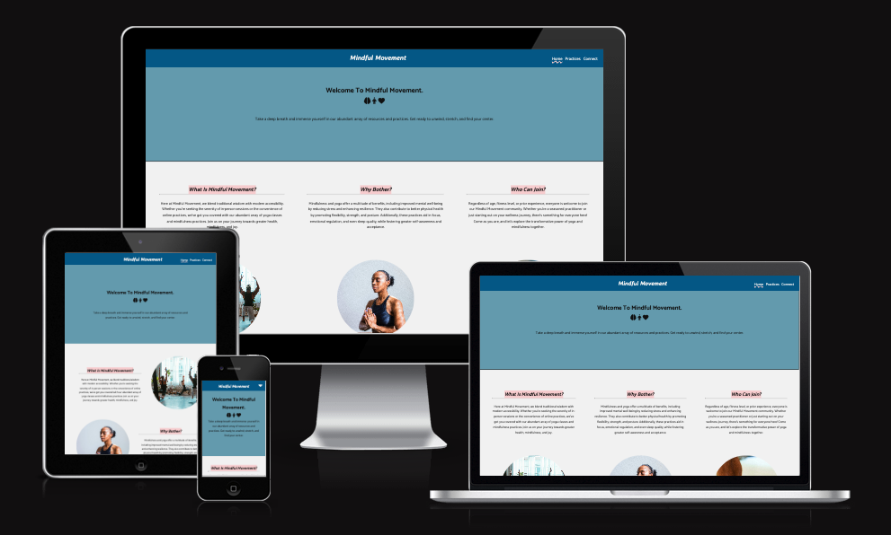
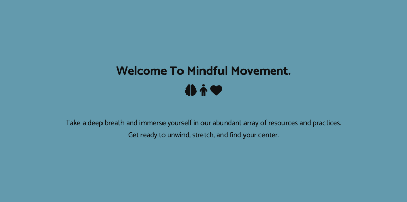
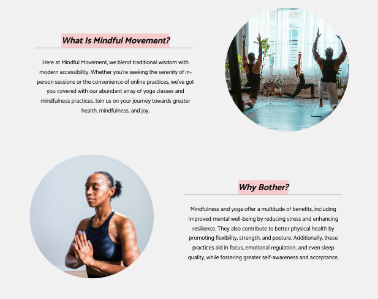
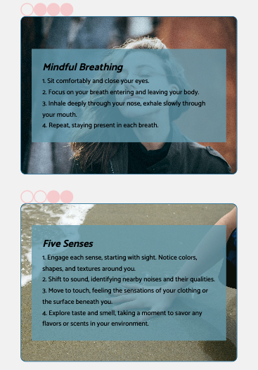
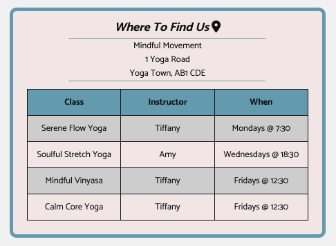
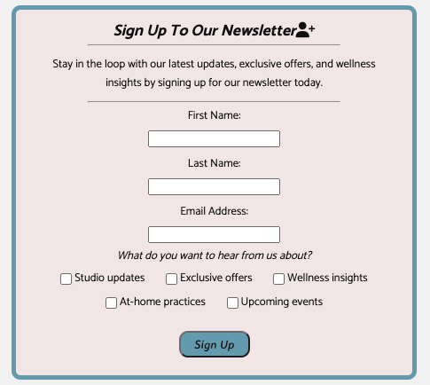
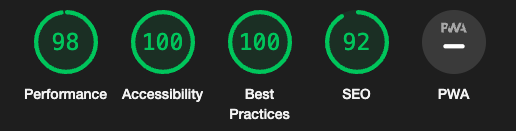

# Mindful Movement

Mindful Movement is a comprehensive website that fosters engagement with mindfulness and yoga practices. The website aims to provide users with a user-friendly interface that educates them about the principles of mindfulness and yoga, including their benefits and target audience. Key features include instructional resources for at-home practice, a studio timetable for in-person sessions, and a newsletter signup option for community engagement. Mindful Movement aims to empower users to embark on a journey of self-discovery and holistic well-being through accessible digital means.

## Features 

- __Navigation Bar__

  - Featured on all three pages, the fully responsive navigation bar includes links to the Logo, Home page, Practices and Connect page and is identical in each page to allow for easy navigation.
  - The navigation bar shows the company name in the center with links to pages on the right hand side, without offsetting the central alignment of the logo.
  - The fonts and colour scheme chosen are gentle and comforting to reflect the company ethos.
  - The links change colour when hovered over to show the user that they are clickable. The hover colour is one of the key colours of the website.
  - Active links are styled with a wavy underline which corresponds to the 'flow' theme of the website.

- __The Header__

  - The header features a hero block with centered text to welcome users to the website and encourage them to explore.  
  - The header introduces the other main colour of the website in an eye-grabbing CTA.
  - The use of icons clearly shows the purpose the website.

- __Company Description__

  - The description of the company falls into three sections, detailing who we are, why you should get involved, and who can join. 
  - The images for each section relate to the information.
  - On tablets, the image/text switch sides with every other section to spread out the information, making the website easier to digest.
  - On laptops, information is spread horizontally to fill the space more effectively.
  - The highlighted headers are common across all pages to draw the eye of the user and clearly divide the sections.

- __Footer__ 

  - The footer section includes links to the relevant social media sites for Mindful Movement. The links will open to a new tab to allow easy navigation for the user. 
  - The footer is valuable to the user as it encourages them to keep connected via social media.
  - The footer matches the style of the navigation bar for brand consistency and ease of navigation.
  - Footer links use the same hover style as navigation bar links.

- __Practices Page__ 

  - The practices page contains 4 examples of techniques that can be practiced at home. 
  - Each technique contains a background image relating to the practice, with an overlay box containing a list of simple steps to follow.
  - The overlay box is partially transparent so the background image can be seen, whilst still allowing text to be readable. 
  - Each technique has a progress bar attached which guides the user through the content. The progress bar moves to fill appropriate space on larger devices and is styled using circles (a running theme on the site) and the same colour scheme.

- __Timetable__ 

  - On the connect page you find a timetable with the class schedule, and the location of the studio. 
  - It is styled in line with other pages and contains all information users need to join us in person.
  - The icon used reflects the content.

- __Newsletter__ 

  - Also on the connect page is an option to sign up for our newsletter.
  - The form has required fields for first name, last name and email to ensure all necessary information is collected.
  - The form also has options to select things they are interested in hearing about to tailor the newsletter to their preferences. 

## Testing 

### Manual Testing
- Feature testing:
  - All internal links navigate to correct pages.
  - All external links open in new tabs.
  - Images all display correctly, and when they fail to load the flow of the website still works correctly.
- Interactivity:
  - Menu toggle shows dropdown items correctly on smaller devices.
  - Form for signing up to the newsletter submits correctly.
- Usability:
  - Colour schemes are readable for all users (checked with [WebAim Contrast Checker](https://webaim.org/resources/contrastchecker/))
  - All pages are responsive to screen sizes. 
  - All pages render and function correctly on different browsers (checked Chrome, Firefox, Safari, Edge and Opera using [BrowserStack](https://live.browserstack.com/))

### Validator Testing 

- HTML
  - No errors were returned when passing through the official W3C validator
- CSS
  - No errors were found when passing through the official (Jigsaw) validator
  - 

      
    

- Accessibility
  - Colours and fonts chosen are easy to read and accessible (checked using lighthouse in devtools)

### Unfixed Bugs

N/A

## Deployment

- The site was deployed to GitHub pages. The steps to deploy are as follows: 
  - In the GitHub repository, navigate to the Settings tab 
  - From the source section drop-down menu, select the Master Branch
  - Once the master branch has been selected, the page will be automatically refreshed with a detailed ribbon display to indicate the successful deployment. 

The live link can be found here - [Mindful Movement](https://emilywade.github.io/mindful-movement/)

## Credits 

### Content 

- The fonts were taken from [Google Fonts](https://fonts.google.com/)
- The icons were taken from [Font Awesome](https://fontawesome.com/)
- The code for the footer was taken from the [CI Love Running Project](https://github.com/Code-Institute-Solutions/love-running-v3)

### Media

- The photos used on the home page are all from [Unsplash](https://unsplash.com/) and [Pexels](https://www.pexels.com/)
